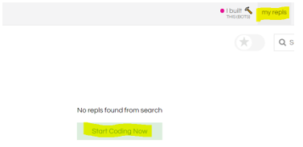
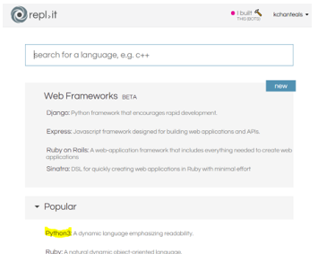
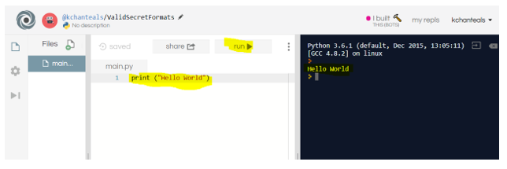

# Python Online Editor Sign Up
We will be using the online IDE [repl.it](https://repl.it) to write python code this semester.  Below are instructions for how to sign up, name a Python 3 program, and run a program.  Refer to this sheet if you are having difficulties.

## Sign Up Instructions

1.	To create a repl.it account to use with Python, navigate to https://repl.it/.

2. Create an account by clicking the "Sign Up" in the upper right corner:
<br/><br/>


3. Enter your information for the account by filling out the "username", "email", "password", and click "Sign up".

4. Set your account setting by clicking your username in the upper corner and selecting "Account" in the drop down list:
<br/><br/>


5. Fill out your profile by entering your "First Name", "Last Name", and search for your school name ____________, click "Save":
<br/><br/>


6. You can now view the content of your course.

## Creating a new Python 3 Program and Submitting Link
1. To create a new program click "my repls" on the tool bar followed by "Start Coding Now":
<br/><br/>


2. To create a Python program select "Python3":
<br/><br/>


3. To continue click the "Got it" in the "Add files and folders to your project" dialog box:
<br/><br/>


4. To test your account create the "Hello World" program.  In the center text editor panel type:

```Python
print ("Hello World")
```
and click "Run" in the center top menu bar.  You should see the text "Hello World" displayed in the right output panel.
<br/><br/>

