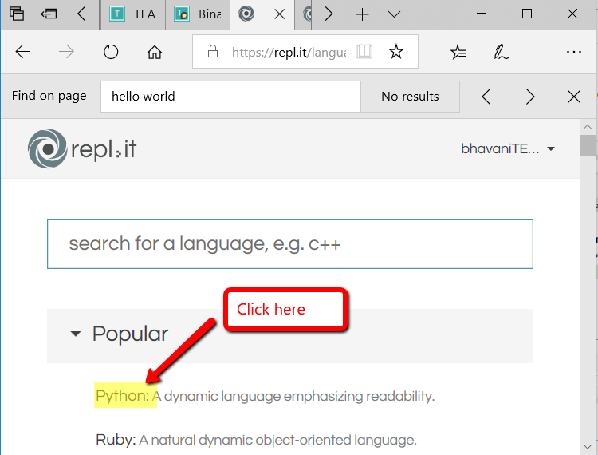
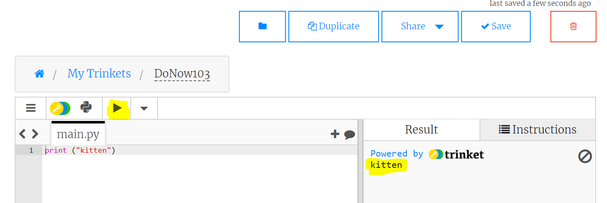

# Do Now 1.03

Open and save a new project called `DoNow103` in your IDE or text editor.

Practice typing the following expressions in the editor and running the code.

## Expression 1

`2 * 3 * 5`

### Expression 2

`"abc"`

### Expression 3

`"abc" + "bde"`

## Now try typing the statement below into the file. Save and run the code

```python
print(2*3*5)
```

Write down the result. Explain what `print` does. Try printing out 3 different values.

## How to open, save, and run a file

1. Open a Python 3 project:

    

2. Run the program

    
