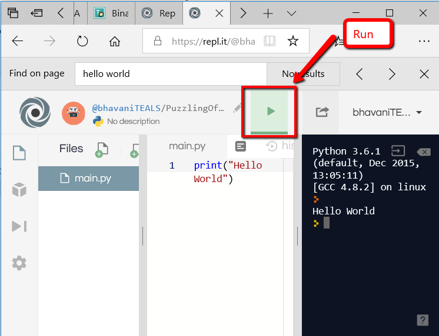

## Do Now 1.03
Open and save a new project called `DoNow103` in the IDE. Run a program by clicking the ">" Run button. See the instructions below for how to open, save, and run a file in the online IDE.

Practice typing the following expressions in the editor and running the code. 
 
`2 * 3 * 5`
<br>
`"abc"`
<br>
`"abc" + "bde"`
<br>

Now try typing the statement below into the file. Save and run the code. 
```python
print(2*3*5)
```
Write down the result. Explain what `print` does. Try printing out 3 different values.

## SNAP Flashback – Print Command

 


## How to open, save, and run a file 
1. Open


2. Save


3. Run 


