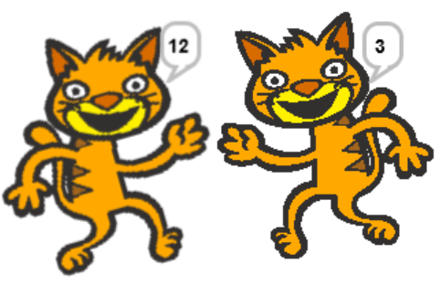

# Lab 1.03 - Printing & Variables
## Part 1 - Printing Practice 

Practice typing out some statements in the editor part of the IDE, then hit "Run" at the top of the screen:

| Expression | Expected Output | Did anything unexpected happen? |
|------------|-----------------|--------|
|`print("1")`|                 |        |
|`print(1)`|                   |        |
|`print(1 + 2)`|               |        |
|`print("1" + "2")`|           |        |
|`print("this" + " " + "is" + " " + "a" + " " + "sentence" + ".")`|              |   |        |


## SNAP Flashback - Print Comparison



## Part 2 - Variables Practice

1. Type and run the following code. 
```python
animal = "dogs"
print(animal + " are really cool.")
```
What happens? How would you make the program print out "cats are really cool" instead? 
<br>
<br>
<br>
2. Type and run the following code. 
```python
print(dogs + " are cool.")
```
What output does this produce? Why does this happen?
<br>
<br>
<br>
3. Rewrite the following SNAP! program in Python: 


## Part 3 - Four Fours

The four fours challenge!
Using four 4's and any operations, try to write equations that have the numbers from 0 to 4 as the answer.
You should use Python's arithmetic operations:
* \+    addition
* \-    subtraction or negation
* \*    multiplication
* /    division
* (   )    parentheses for grouping
* **    power
<br>

You may also use 44 or 4.4, which count as two fours,
or .4, which counts as one four.
<br>
For example, one solution for zero is:
```python
print("Zero is", 44-44)
```
<br>
Can you find a different solution?
<br>
Here are what the results, but not the source code, will look like. (Note: answers may have trailing zeros if floating point arithmetic is used which is fine, i.e. 1 may be displayed as 1.0)
<br>
```
Zero is 0
One is 1
Two is 2
Three is 3
Four is 4
```

## Bonus!
Print the output below, but only using **one** line of code. Feel free to use online resources.
```
Wow!
This is on a new line! 

```
## Bonus 2!
Can you find four fours for 5 to 10?
