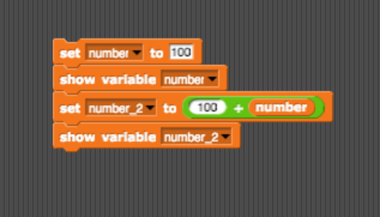

# Worksheet 1.03
## Part 1 - Printing Practice 

Practice typing out some statements in the editor part of the IDE, then hit "Run" at the top of the screen:

| Expression | Expected Output | Did anything unexpected happen? |
|------------|-----------------|--------|
|`print(“1”)`|                 |        |
|`print(1)`|                   |        |
|`print(1 + 2)`|               |        |
|`print(“1” + “2”)`|           |        |
|`print(“this” + “ “ + “is” + “ “ + “a” + “ “ + “sentence” + “.”)`|              |   |        |

##Bonus!
Print the output below, but only using **one** print statement. Feel free to use online resources.
```
Wow!
This is on a new line! 

```

## Part 2 - Variables Practice

1. Type and run the following code. 
```python
animal = "dogs"
print(animal + " are really cool.")
```
What happens? How would you make the program print out "cats are really cool" instead? 
<br>
<br>
<br>
2. Type and run the following code. 
```python
print(dogs + " are cool.")
```
What output does this produce? Why does this happen?
<br>
<br>
<br>
3. Rewrite the following SNAP! program in Python: 


