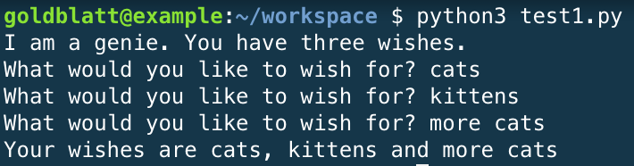
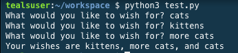

# Lab 1.04 - Magic Genie

**Goal**: Use Python to interact with variables and user input. 

Create a genie program. Save the file as `magic_genie.py`. 

1. Have the program introduce itself. Then have the program ask for three separate wishes. Finally, print all the wishes together. 

2.  There are some repeated strings in this genie program. Move those into variables.   

3.  Now it's time to make your genie confused. Edit your code to have him print your first wish as your last wish, and your second wish as your first wish, and your third wish as your second wish. 

## SNAP Flashback – Magic Genie

### Hint!
Remember to add spaces you can combine `" "`  to the end of your string using the `+` operator. So `print("hello" + " " + "student")` would print `hello student`