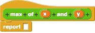

# Lesson 3.03: Return vs Print

## Learning Objectives
Students will be able to... 
* Define and identify: **return, none, void**
* Explain and demonstrate the difference between printing and returning

## Materials/Preparation
* [Do Now]
* [Lab - War (Card Game)]
* Associated Reading - section 3.3 of Book
* Read through the do now, lesson, and lab so that you are familiar with the requirements and can assist students.
* Note that this lesson may take two days.

## Pacing Guide
| **Duration**   | **Description** |
| ---------- | ----------- |
| 5 Minutes  | Do Now      |
| 10 Minutes | Lesson      |
| 35 Minutes | Lab         |
| 5 Minutes | Debrief  |
| **Day 2**  |             |
| 10 Minutes | Recap & Review     | 
| 40 Minutes | Finish Lab  |
| 5 Minutes | Debrief  |  

## Instructor's Notes
### 1. Do Now
    * Students experiment with a function that returns a value, but they must add a print command to output that value. 

### 2. Lesson
* Ask students about what they think the difference between returning and printing is. 

#### Student Sharing
* Get a volunteer to describe how they rewrote the code in the Do Now to get a value output.
* Ask a student to write the code on the board. 

#### Discussion
* Discuss the concept of the function contract again, explaining that the functions we will work with have both inputs and outputs.
* Returning is a concept in Snap!, just with a different name: reporting. 

 

#### Activity
* Students work together to build a structure using cards. 
 1. One student volunteer represents the `give_card` function. 
 2. This students holds the deck of cards and stands by the board. 
 3. On the board display the `give_card` function in code code that only **prints** the value of a randomly chosen card. 
 4. Students 'call' the student and request cards, which then the student follows the instructions and draws ('prints') the card on the board.
 5. Display a new `give_card` function that **returns** a card instead. 
 6. Have students 'call' the function, however this time have the `give_card` student pass out the card when a student calls him/her. 

* Debrief the activity and talk about what was learned. 

### 3. Lab
* Given a shuffled deck list, students will create a program that plays the game 'War' with the user. 
    
### 4. Debrief
* Check student progress and completion of the lab, wrap up by taking any final questions.

## Accommodation/Differentiation
As an extension activity, ask students to research the shuffle function and the functions associated with it.

## Forum discussion
[Lesson 3.03: Return vs Print (TEALS Discourse Account Required)](https://forums.tealsk12.org/c/2nd-semester-unit-3-functions/lesson-3-03-return-vs-print)

  

[Do Now]:do_now.md
[Lab - War (Card Game)]:lab.md
